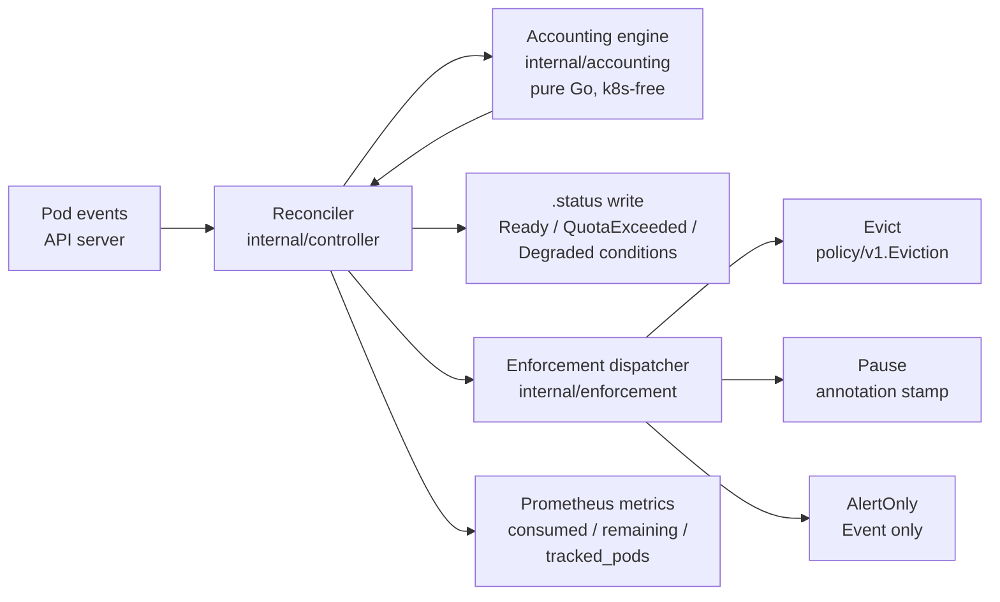

# gpu-k8s-operator

A namespaced Kubernetes operator that tracks cumulative GPU-hour
consumption for pods matching a label selector against a rolling-window
quota, and enforces that quota via eviction, pause annotations, or
alert-only mode.


*Scene A: 8 pods launch against a quota deliberately set to be
crossable in seconds; `CONSUMED` climbs past it, `TRACKED=8`. Scene B:
the operator pod is deleted — when the new pod comes up, the
controller-runtime informer rebuilds from the API-server view and the
same 8 pods are re-observed. State wasn't persisted and none was lost;
the counter keeps climbing. Regenerate with `make demo`.*

## Why this matters

Cumulative GPU-hour budgets are the quota primitive AI-cloud platforms
use to keep shared fleets fair and predictable: teams get an allowance
per window, workloads stay fungible across nodes, and billing stays
out of the hot path. This operator is a self-contained implementation
of that control plane — rolling-window accounting, grace-period
enforcement, stateless restart recovery — all driven by a single CRD
(`GPUWorkloadBudget`, group `budget.zxuhan.dev`, version `v1alpha1`).
Accounting is derived from the API-server view on every reconcile, so
a restart recovers from cluster state rather than from a cache;
[docs/accounting-model.md](docs/accounting-model.md) explains the
bounded-error guarantees.

When `nvidia.com/gpu` is absent (e.g. a kind cluster) the accounting
engine falls back to scaled CPU-second counting: set
`spec.gpuResourceName: cpu` and the same control loop drives against
`resource.Quantity` CPU requests. The e2e and bench suites both rely
on this path.

## Quickstart

### Install with Helm

```sh
# cert-manager is a prerequisite for the validating webhook.
helm upgrade --install cert-manager jetstack/cert-manager \
  --namespace cert-manager --create-namespace \
  --set crds.enabled=true

helm upgrade --install gwb-operator ./deploy/helm/gwb-operator \
  --namespace gpu-k8s-operator-system --create-namespace
```

### Create a budget

```yaml
apiVersion: budget.zxuhan.dev/v1alpha1
kind: GPUWorkloadBudget
metadata:
  name: team-a
  namespace: default
spec:
  selector:
    matchLabels:
      team: a
  quota:
    gpuHours: "100"
    windowHours: 24
  enforcement:
    action: AlertOnly
    gracePeriodSeconds: 60
```

Then watch:

```sh
kubectl get gwb team-a -w
```

## How it works



Three packages, separated so each is independently testable:

- **`internal/accounting/`** — pure Go, k8s-free. Given a set of pods
  with `(Start, End, GPUs)`, computes `consumedGpuHours`, clamps
  `remainingGpuHours` at zero, and flags `over`. Unit-tested to ~ns
  precision.

- **`internal/controller/`** — the reconciler. Translates
  k8s `Pod` objects to accounting input (see `pod_conversion.go` for
  the `earliestContainerStart` / `latestContainerFinish` rules),
  writes `.status`, and patches `Ready`/`QuotaExceeded`/`Degraded`
  conditions.

- **`internal/enforcement/`** — one implementation per
  `spec.enforcement.action`: `Evict` submits `policy/v1.Eviction`,
  `Pause` writes an annotation, `AlertOnly` emits an event and records
  the action in `lastEnforcementAt`. Grace periods are wall-clock.

The validating webhook rejects empty selectors, zero quotas, and
unknown enforcement actions at admission time so the controller never
sees malformed state. It is validating only — see
[docs/limitations.md](docs/limitations.md#webhook) for why.

## Metrics

Exposed on an HTTPS endpoint guarded by Kubernetes TokenReview
(enable the Helm ServiceMonitor to scrape from kube-prometheus-stack):

| Metric | Meaning |
|---|---|
| `gwb_consumed_gpu_hours{namespace, name}` | current `.status.consumedGpuHours` |
| `gwb_remaining_gpu_hours{namespace, name}` | `quota − consumed`, clamped |
| `gwb_enforcement_actions_total{action, namespace, name}` | counter incremented per action fired |
| `gwb_tracked_pods{namespace, name}` | pods matched by selector at last reconcile |
| `gwb_accounting_accuracy_ratio{namespace, name}` | registered, currently always 0 — the operator doesn't know ground truth; the bench harness computes this externally and writes it to `bench-results/…/results.json` |

Controller-runtime's default metrics (reconcile latency, workqueue
depth, etc.) are served alongside.

## Benchmarks

```sh
make bench    # one scenario → bench-results/YYYY-MM-DD/SUMMARY.md
make chaos    # restart-correctness scenario → chaos-results/YYYY-MM-DD/SUMMARY.md
```

The accuracy formula and the reason benches run on kind are in
[docs/benchmark-methodology.md](docs/benchmark-methodology.md).

### Measured numbers (kind, M-series laptop, 2026-04-20)

Recorded in-repo under [`bench-results/2026-04-20/`](bench-results/2026-04-20/)
and [`chaos-results/2026-04-20/`](chaos-results/2026-04-20/). Regenerate
any time with `make bench` / `make chaos` — the harness owns the
numbers, the README just quotes them.

**Steady-state accuracy** — 50 busybox pods at 10/s, 30s runtime each,
0.1 CPU "GPU" per pod, snapshot at t=45s (all pods terminated):

| Metric | Value |
|---|---|
| reported GPU-hours | 0.04000 |
| expected GPU-hours | 0.04167 |
| **accuracy ratio** | **0.96** |
| delta | −6 pod-seconds |
| tracked pods | 50 |

The −6-pod-second delta is the kubelet start-up lag: the accounting
engine counts from `state.running.startedAt`, which kubelet stamps a
fraction of a second after pod-create. See
[docs/accounting-model.md](docs/accounting-model.md) for the formula.

**Restart correctness** — same workload, runtime bumped to 60s so pods
are still Running when we snapshot. Operator pod deleted at t=15s;
post snapshot at t=120s (`CHAOS_POST_SECONDS=120`):

| Phase | Elapsed | Tracked pods | Reported | Expected | Accuracy |
|---|---|---|---|---|---|
| pre-restart  | 15s  | **50 / 50** | 0.0120 | 0.0174 | 0.69 |
| post-restart | 120s | **50 / 50** | 0.0830 | 0.0833 | **0.996** |

The headline is `tracked_pods = 50` on both sides of the restart: when
the new operator pod comes up, controller-runtime's informer rebuilds
from the API-server view and every pod is re-observed. No state was
persisted and none was lost. The pre-restart 0.69 is reconcile cadence
against a fresh workload (first snapshot lands one reconcile after
workload launch). Once the operator has had a few ticks to re-sum
everyone's elapsed runtime, the post-restart reading converges to
0.996 — essentially the same accuracy as `make bench`, which says the
restart cost nothing.

## Development

Prerequisites: Go 1.23+, Docker, kubectl, kind.

```sh
make test                # unit + envtest suites
make test-e2e            # Ginkgo against a fresh kind cluster
make lint                # golangci-lint v2
make manifests generate  # regen CRD + deepcopy after API changes
make helm-lint           # lint the Helm chart (requires helm)
make demo                # regenerate docs/media/demo.gif (requires vhs)
```

The `config/` directory holds the kustomize sources; `make
build-installer` emits a single-file `dist/install.yaml` that's
functionally equivalent to the Helm chart for air-gapped clusters.

## Run on Azure (AKS)

The `deploy/aks/` directory ships a Bicep template + `parameters.example.json`
that provision an AKS cluster (1.31, 2× B2s, Azure CNI overlay) and a
Basic ACR with `adminUserEnabled: false` and an AcrPull role assignment
to the cluster's kubelet identity. `.github/workflows/aks-deploy.yml`
then builds the operator image on every push, pushes it to ACR, and
runs `helm upgrade --install` against the cluster via
`azure/setup-helm`. Intended for a student subscription — the
trade-offs (no GPU node pool, no monitoring addon, public API server)
are documented in [`deploy/aks/README.md`](deploy/aks/README.md).

Required repo secrets: `AZURE_CREDENTIALS`, `AZURE_RESOURCE_GROUP`,
`AKS_CLUSTER_NAME`, `ACR_NAME`.

## Repository layout

```
api/v1alpha1/             GPUWorkloadBudget types + validation markers
cmd/main.go               Manager entry point
config/                   Generated CRD, RBAC, webhook, manager manifests
internal/accounting/      Pure-Go budget math
internal/controller/      Reconciler + pod-status conversion
internal/enforcement/     Evict / Pause / AlertOnly handlers
internal/webhook/         Validating webhook
test/e2e/                 Ginkgo e2e suite
test/bench/               Accuracy harness + gwb-bench CLI
test/workload-generator/  gwb-workload CLI
hack/                     bench.sh, chaos.sh, demo/, helm-lint.sh, bench-stack/
deploy/helm/gwb-operator/ Helm chart
deploy/aks/               Bicep + parameters for AKS
docs/                     accounting-model, benchmark-methodology, limitations
docs/media/               demo.gif (regenerable via `make demo`)
```

## Status and limitations

Alpha. Full list of known issues and scope boundaries:
[docs/limitations.md](docs/limitations.md). The TL;DR:

- Single-budget bench only; overlapping selectors work but aren't
  measured.
- Enforcement respects PDBs — a protected workload can stay
  over-quota until the PDB changes.
- Benches run on kind with simulated CPU-as-GPU; real NVIDIA
  device-plugin behaviour is not exercised.

## License

Apache 2.0 — see [`LICENSE`](LICENSE).
