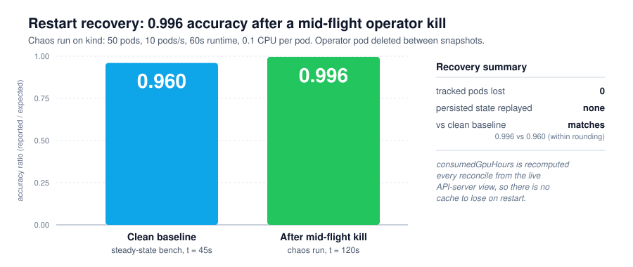
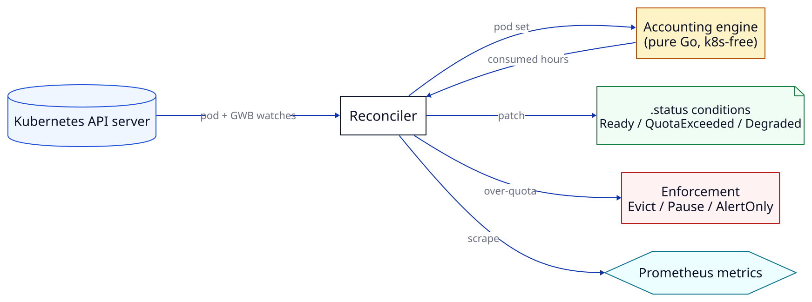

<h1 align="center">gpu-k8s-operator</h1>

<p align="center">
  
  
  
  
  <a href="https://github.com/zxuhan/gpu-k8s-operator/actions/workflows/test.yml"></a>
  <a href="https://github.com/zxuhan/gpu-k8s-operator/actions/workflows/test-e2e.yml"></a>
</p>

<p align="center">
A Kubernetes operator for rolling-window GPU-hour budgets. Stateless accounting recomputes from the live API view every reconcile; a mid-flight operator kill reconverges to 0.996 accuracy on kind, with zero pods lost from the informer. Enforcement via eviction, pause, or alert.
</p>

<p align="center">
  
</p>

<p align="center"><sub><i>Grafana panels driven by the operator's Prometheus metrics. The gauge climbs past the quota line as 8 pods run against a tight quota. Midway through, the operator pod is killed; the tracked-pods stat holds at 8 because state is rebuilt from the API view on restart, not from a cache.</i></sub></p>

## Results

Measured on a kind cluster (M-series laptop, 2026-04-20). Raw outputs are checked in under [`bench-results/2026-04-20/`](bench-results/2026-04-20/) and [`chaos-results/2026-04-20/`](chaos-results/2026-04-20/); the harness owns the numbers and the README quotes them.

### Scenario

| Parameter | Steady-state bench | Chaos run |
|---|---|---|
| pods | 50 | 50 |
| arrival rate | 10 pods/s | 10 pods/s |
| per-pod runtime | 30s | 60s |
| resource per pod | 0.1 CPU (simulated GPU) | 0.1 CPU |
| snapshots | t = 45s | t = 15s, t = 120s |
| event | none | operator pod deleted between snapshots |
| cluster | kind on Docker | kind on Docker |

### Measurements

| Scenario | Tracked pods | Reported GPU-hours | Expected | Accuracy | Delta |
|---|---|---|---|---|---|
| Steady-state bench | 50 / 50 | 0.04000 | 0.04167 | **0.960** | -6 pod-seconds |
| Chaos, pre-kill snapshot | 50 / 50 | 0.01200 | 0.01743 | 0.688 | -19 pod-seconds |
| Chaos, post-recovery snapshot | 50 / 50 | 0.08300 | 0.08333 | **0.996** | -1 pod-second |



### Key observations

- **`tracked_pods` stays at 50/50 across the operator kill.** The replacement pod's informer rebuilds from the API-server view and re-observes every pod. Nothing is replayed from a cache because nothing was ever cached.
- **Post-recovery accuracy is on par with the clean baseline.** 0.996 after the kill matches the 0.960 steady-state run to within rounding. The chaos event did not move the accuracy needle.
- **The pre-kill 0.688 is workload-freshness, not chaos damage.** The first chaos snapshot lands at t=15s, one reconcile cadence after a 50-pod workload starts arriving. Two cadences later the accounting converges; the operator kill happens in between.
- **The sub-second delta is kubelet, not the operator.** Steady-state's -6 pod-seconds is the kubelet start-up lag between pod create and `state.running.startedAt`. The engine counts from `startedAt`, so image-pull and scheduling slop never hit the quota.

### Why the numbers hold

1. **Accounting is derived, not stored.** `internal/accounting/` is a pure-Go function: given a pod set with `(Start, End, GPUs)`, compute consumed GPU-hours. No in-memory ledger, no rolling counter, nothing to lose on restart or drift over weeks.
2. **`.status.consumedGpuHours` is overwritten, not accumulated.** Every reconcile writes the freshly computed value. A bug in one reconcile self-heals on the next.
3. **The reconciler does no math.** It translates pods to accounting input (see [`internal/controller/pod_conversion.go`](internal/controller/pod_conversion.go)) and writes status. All numeric logic lives in `internal/accounting/`, unit-tested to nanosecond precision.
4. **GPU-less clusters use the same code path.** Set `spec.gpuResourceName: cpu` and the engine treats fractional CPU as fractional GPU. The e2e and bench suites both rely on this; see [`docs/accounting-model.md`](docs/accounting-model.md) for the bounded-error guarantee when kubelet GC'es a pod the operator never saw.

## Architecture



Three packages, each independently testable:

- **`internal/accounting/`** is pure Go, k8s-free. Given a pod set with `(Start, End, GPUs)`, returns consumed GPU-hours, clamped remaining, and an over-quota flag.
- **`internal/controller/`** is the reconciler. It translates `Pod` objects to accounting input, patches `.status`, and toggles `Ready` / `QuotaExceeded` / `Degraded` conditions.
- **`internal/enforcement/`** dispatches one of three actions per `spec.enforcement.action`: `Evict` submits `policy/v1.Eviction`, `Pause` writes an annotation, `AlertOnly` records a Kubernetes Event. Grace periods are wall-clock.

The validating webhook (`internal/webhook/v1alpha1/`) rejects empty selectors, non-positive quotas, and unknown enforcement actions at admission. Validating-only by design; see [`docs/limitations.md`](docs/limitations.md).

Prometheus metrics on a TokenReview-guarded HTTPS endpoint, plus controller-runtime's default reconcile-latency and workqueue series. Enable the Helm ServiceMonitor to scrape from `kube-prometheus-stack`.

| Metric | Meaning |
|---|---|
| `gwb_consumed_gpu_hours` | current `.status.consumedGpuHours` |
| `gwb_remaining_gpu_hours` | `quota - consumed`, clamped at zero |
| `gwb_enforcement_actions_total` | counter, incremented per action fired |
| `gwb_tracked_pods` | pods matched by the selector at last reconcile |
| `gwb_accounting_accuracy_ratio` | registered but always zero; the operator does not know ground truth, the bench harness writes the ratio externally |

## Quickstart

Prerequisites: a Kubernetes cluster, `helm`, and `cert-manager` (the webhook needs TLS).

```sh
helm upgrade --install cert-manager jetstack/cert-manager \
  --namespace cert-manager --create-namespace \
  --set crds.enabled=true

helm upgrade --install gwb-operator ./deploy/helm/gwb-operator \
  --namespace gpu-k8s-operator-system --create-namespace
```

Create a budget:

```yaml
apiVersion: budget.zxuhan.dev/v1alpha1
kind: GPUWorkloadBudget
metadata:
  name: team-a
  namespace: default
spec:
  selector:
    matchLabels:
      team: a
  quota:
    gpuHours: "100"
    windowHours: 24
  enforcement:
    action: AlertOnly
    gracePeriodSeconds: 60
```

Watch it move:

```sh
kubectl get gwb team-a -w
```

For air-gapped clusters, `make build-installer` emits a single-file `dist/install.yaml` equivalent to the Helm chart.

## Project structure

```
.
├── api/v1alpha1/             GPUWorkloadBudget types and validation markers
├── cmd/main.go               manager entry point
├── config/                   generated CRD, RBAC, webhook, manager manifests
├── internal/
│   ├── accounting/           pure-Go budget math
│   ├── controller/           reconciler and pod-status conversion
│   ├── enforcement/          Evict / Pause / AlertOnly handlers
│   └── webhook/v1alpha1/     validating webhook
├── test/
│   ├── e2e/                  Ginkgo end-to-end suite
│   ├── bench/                accuracy harness and gwb-bench CLI
│   └── workload-generator/   gwb-workload CLI
├── hack/                     bench.sh, chaos.sh, demo/, helm-lint.sh, bench-stack/
├── deploy/
│   ├── helm/gwb-operator/    Helm chart
│   └── aks/                  Bicep template and parameters for AKS
└── docs/
    ├── diagrams/             D2 sources for the architecture diagram
    └── media/                rendered SVGs and demo.gif
```

## Reproduce

To reproduce the numbers in the Results section on your own laptop you need Go 1.23+, Docker, `kubectl`, and `kind`.

```sh
make test       # unit and envtest suites
make test-e2e   # Ginkgo against a fresh kind cluster
make bench      # accuracy run, writes bench-results/YYYY-MM-DD/SUMMARY.md
make chaos      # restart-correctness run, writes chaos-results/YYYY-MM-DD/SUMMARY.md
```

Scenario knobs for `make bench` (count, rate, runtime, gpus, observe-window) and the accuracy formula live in [`docs/benchmark-methodology.md`](docs/benchmark-methodology.md) and at the top of `hack/bench.sh`.

For Azure (AKS), [`deploy/aks/`](deploy/aks/) ships a Bicep template plus `parameters.example.json` that provisions an AKS cluster (1.31, 2x B2s, Azure CNI overlay) and a Basic ACR. The workflow at [`.github/workflows/aks-deploy.yml`](.github/workflows/aks-deploy.yml) builds the operator image, pushes it to ACR, and runs `helm upgrade --install` against the cluster. Intended for a student subscription; trade-offs (no GPU node pool, no monitoring addon, public API server) are in [`deploy/aks/README.md`](deploy/aks/README.md). Required repository secrets: `AZURE_CREDENTIALS`, `AZURE_RESOURCE_GROUP`, `AKS_CLUSTER_NAME`, `ACR_NAME`.

## Limitations

Alpha. Full list at [`docs/limitations.md`](docs/limitations.md). The short version:

- **Kind, not production.** All numbers are from a kind cluster with `gpuResourceName: cpu` and busybox sleepers. Real NVIDIA device-plugin behaviour is not exercised.
- **Single-budget bench.** Overlapping selectors work in code but are not measured.
- **PDB-respecting enforcement.** Eviction goes through `policy/v1.Eviction`, so a workload behind a zero-disruption PDB stays over-quota until the PDB changes. Documented, not a bug.
- **No long-running cluster proof.** Tens of minutes under bench and chaos, not weeks under production load. The stateless design bounds the in-memory leak surface, but that is an argument rather than an observation.
- **Operator-down accounting loss is bounded by kubelet GC.** Pods that terminate and are GC'd from the API server while the operator is offline contribute zero post-restart. Bounded error in [`docs/accounting-model.md`](docs/accounting-model.md).
